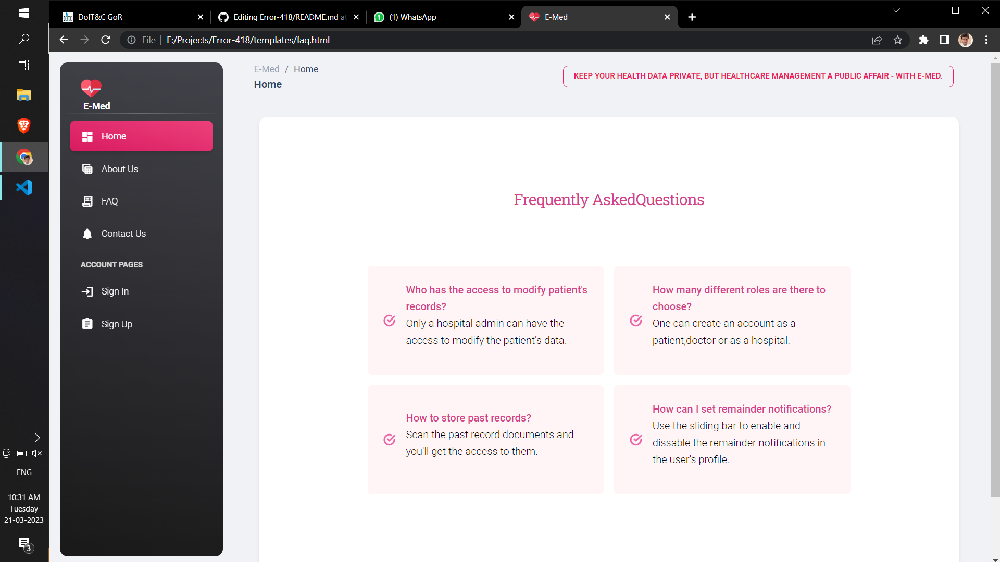
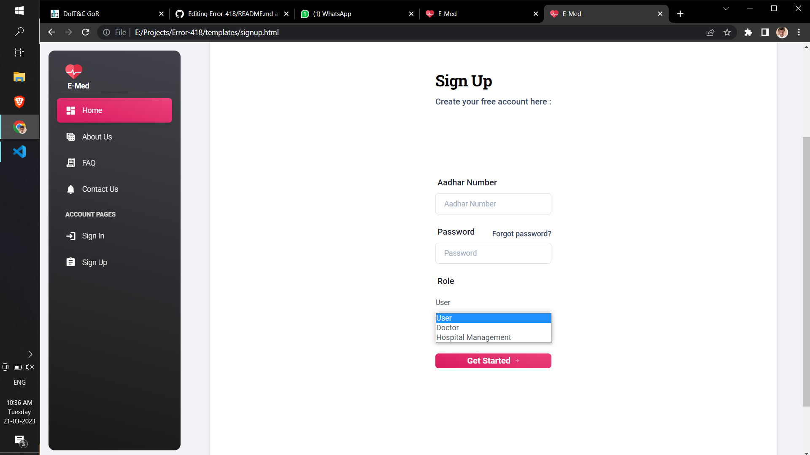
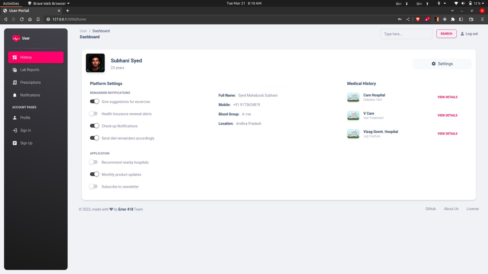
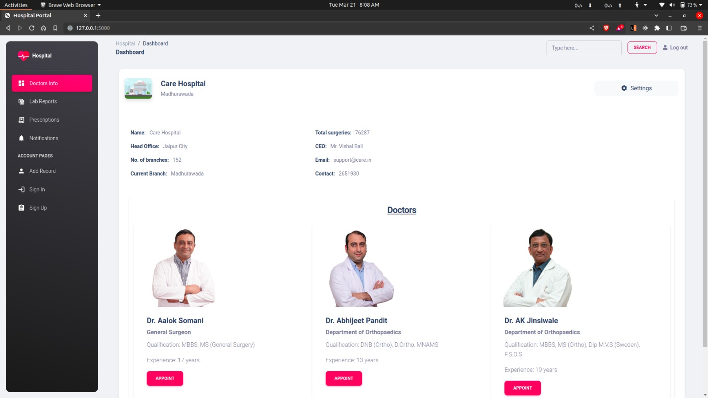
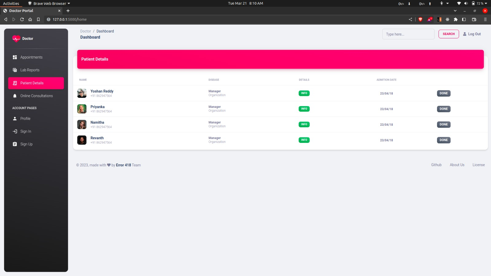
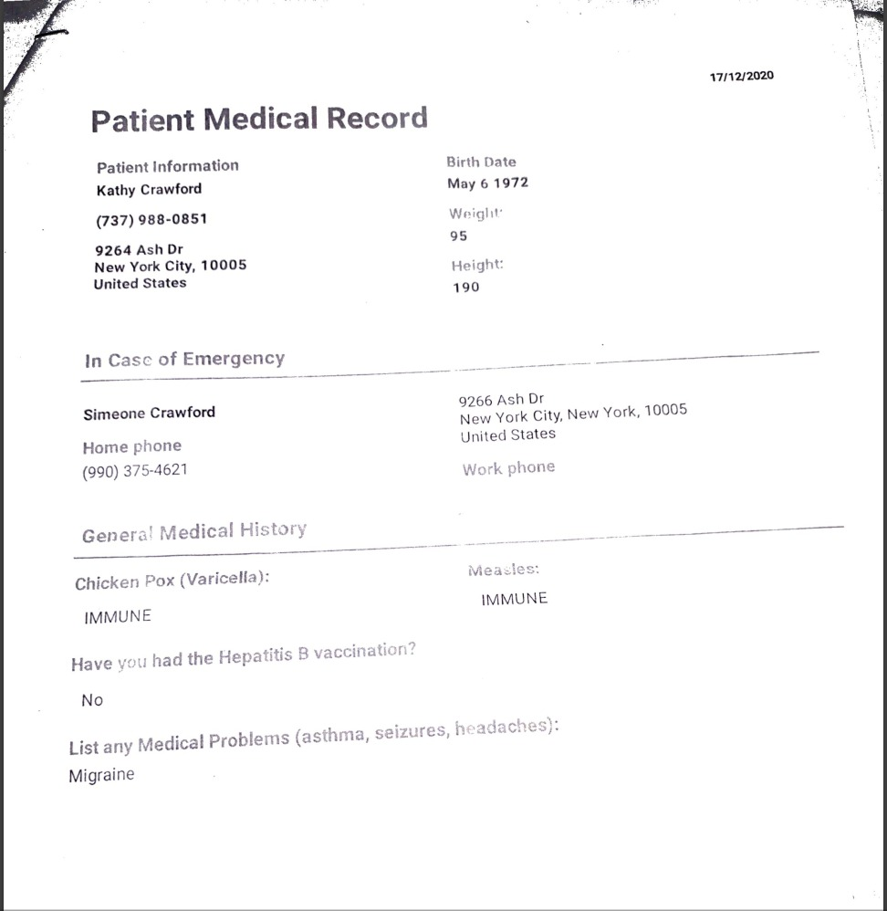

# Rajasthan IT DAY <HACK/ATHON>
# [Project E-Med](https://drive.google.com/drive/folders/1IVCK1t26Dw9OqCntr4aKwKW9HgfyuSuZ?usp=sharing)

## 🔥 Inspiration

Missing medical reports can have a significant impact on patient care in hospitals. When healthcare providers do not have access to a patient's complete medical history, they may not be able to make accurate diagnoses, provide appropriate treatment, or make informed decisions about a patient's care.

Our inspiration behind this initiative is to improve the quality of healthcare services and make them more accessible and efficient. By digitalizing medical records, healthcare providers can access patient information quickly and easily, which can help them make better-informed decisions. Moreover, creating a centralized database can help government agencies to better understand and monitor the health conditions of the population. This can ultimately lead to better health outcomes and reduce the risk of life-threatening situations.

## ❓ What it does
This application provides a platform for patients to view their previous diagnoses, medications, laboratory tests, previous hospital stays, living wills, and even organ donations.

Doctors can access the medical records of the patients assigned to them including their appointments, laboratory test results,, and electronic consultations.

Hospitals will have a platform to manage the patients, they can assign patients to a specific doctor in that hospital and update the medical reports of every individual patient while checking out. For reports that are available as hard copies, this platform provides a scanner that can read any kind of medical receipt and extract the required information

[Powerpoint and Video link](https://drive.google.com/drive/folders/1IVCK1t26Dw9OqCntr4aKwKW9HgfyuSuZ?usp=sharing)

## 🛠 How we built it
**User Interface:** Material UI by Bootstrap, Tailwind CSS, SCSS

**Backend:** Django Framework (Python)

**Database:** SQLite

**API:** Huggingface

**For OCR (Optical Character Recognition):** disreact-optical character recognization, Pytesseract, Hugging face-distilbert model

## 🦾 Challenges we ran into
- We faced difficulty in getting the data from the API as the data in medical receipts is unreliable
- As working with a team, we faced merge conflicts while in the middle of the project
- Integration of Frontend with Backend was a challenging task as we had to sync with the database

## 🐱‍🏍 Accomplishments that we're proud of
By digitalizing medical records, patients and healthcare providers can access patient information quickly and easily, regardless of location. This can improve the quality of care provided to patients and reduce the risk of errors.

## 📑 What we learned
- **Adaptability:** During this hackathon we encountered unexpected challenges which made us pivot our application to meet the time constraint
- **Time Management:** We were able to prioritize tasks.
- **Collaboration:** As working in a team of five, we learned to divide the tasks and work collaboratively using git.

## 📢 What's next for E-Med
A centralized database of medical records can provide valuable data that can be used for research and data analytics, this can help to identify trends and patterns in healthcare, which can be used to develop new treatments and improve patient care.

## Interface:

| Index page     | Authentication |
| ----------- | ----------- |
|      |        |

| Patients      | Hospitals | Doctors     |
| :---        |    :----:   |          ---: |
|       |      |    |
| Only View   | View and assign patients      | Only View      |

## Scanning Health results:
| Physical copy     | Output |
| ----------- | ----------- |
|      | { 'name': 'Kathy Crawford',  'dob': 'May 6 1972',  'phone': '375-4621\n\nGenera',  'problems': 'headaches',  'doa': '30 December 2020' }       |

# Steps To Run Locally and Make Changes

The following command are meant to run in a terminal or cmd
### First create a directory
    mkdir <dir_name>
### Change into to directory
    cd <dir_name>
### Clone this Repo to the present directory
    git clone https://github.com/subhani-syed/Error-418.git .
### Create a Virtual Environment
    python3 -m venv <env_name>
### Activate the Virtual Environment
    source <env_name>/bin/activate
### Install the required Dependencies using PIP
    pip install -r requirements.txt
### Make Migrations and Migrate To Create The Tables
    python3 manage.py makemigrations
    python3 manage.py migrate
### Create a Super User to Access the Admin Site
    python3 manage.py createsuperuser
### Run the Local Server on a specific Port
    python3 manage.py runserver PORT_NO
- By Default it runs on *127.0.0.1:8000*
### To Exit the Virtual Environment
    deactivate
    
If You find this project usefull giving it a  :star2: would be much appreciated. :blush:
